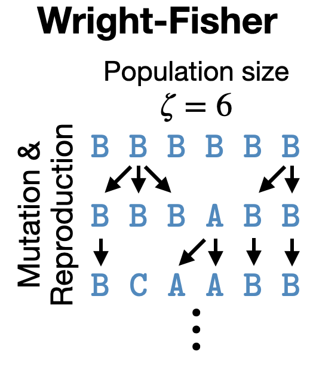
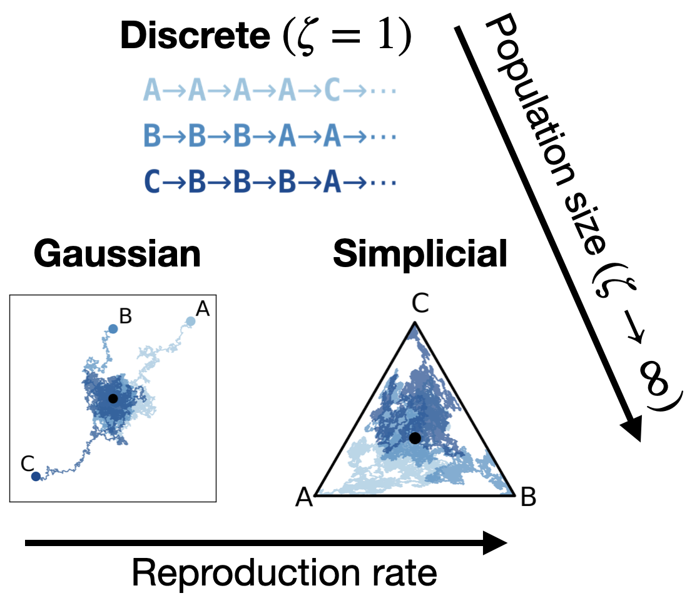

# A Unification of Discrete, Gaussian, and Simplicial Diffusion

[Nuria Alina Chandra](https://nuriachandra.github.io/nchandra/)\*, [Yucen Lily Li](https://yucenli.github.io)\*, [Alan N Amin](https://alannawzadamin.github.io)\*, [Alex Ali](https://alexali04.github.io/), [Joshua Rollins](https://linktr.ee/bit_cryptic), [Andrew Gordon Wilson](https://cims.nyu.edu/~andrewgw/)   
\*Equal Contribution


[Paper]()

<p align="center">
  
  
</p>

### Description
To model discrete sequences such as DNA, proteins, and language using diffusion, practitioners must choose between three major methods: diffusion in discrete space, Gaussian diffusion in Euclidean space, or diffusion on the simplex. Despite their shared goal, these models have disparate algorithms, theoretical structures, and tradeoffs: discrete diffusion has the most natural domain, Gaussian diffusion has more mature algorithms, and diffusion on the simplex in principle combines the strengths of the other two but in practice suffers from a numerically unstable stochastic processes. Ideally we could see each of these models as instances of the same underlying framework, and enable practitioners to switch between models for downstream applications. 
However previous theories have only considered connections in special cases.
Here we build a theory unifying all three methods of discrete diffusion as different parameterizations of the same underlying process: the Wright-Fisher population genetics model. 
In particular, we find simplicial and Gaussian diffusion as two large-population limits.
Our theory formally connects the likelihoods and hyperparameters of these models and leverages decades of mathematical genetics literature to unlock stable simplicial diffusion.
Finally, we relieve the practitioner of balancing model trade-offs by demonstrating it is possible to train a single model that can perform diffusion in any of these three domains at test time.
Our experiments show that Wright-Fisher simplicial diffusion is more stable and outperforms previous simplicial diffusion models on conditional DNA generation.
We also show that we can train models on multiple domains at once that are competitive with models trained on any individual domain.


This codebase implements the unified Wright-Fisher diffusion framework along with instantiations corresponding to discrete, Gaussian, and simplicial diffusion. We also provide instructions to train unified models on protein data.


----
### Code Usage

#### Installation

Install dependencies by running ```pip install .``` with a recent version of Python.

#### Train protein models

To train protein models, you can download Uniref50 data from [here](https://zenodo.org/records/6564798). Place this data in ```data/uniref_2020/uniref50/```.
Then you can train a unified model to do Gaussian, discrete, and simplicial diffusion by running 
```
python3 train.py --config-name=protein_unified
```


#### Train DNA models
You can download the Enhancer design dataset from [here](https://zenodo.org/records/10184648), and place this data so it has the filepath ```data/the_code/...```.
You can train a simplicial diffusion model by running
```
python3 train.py --config-name=dna_simplicial
```

#### Other usage

You can customize the training setup by adding a config file to ```configs/NEW.yaml``` and running ```python3 train.py --config-name=NEW```

- The ```train``` parameters control the training of the diffusion model.
- The ```architecture``` parameters control the underlying architecture.
- The ```model``` parameters control the diffusion model setup.
  - ```model.model``` can be set to ```UnifiedDiffusion```, ```GaussianDiffusion```, ```DiscreteDiffusion```, or ```SimplicialDiffusion```.   
  - ```model.schedule_type``` controls the noise rate function $\beta(t)$ and can be set to ```linear```, or ```cos```.
  - ```model.forward_kwargs``` controls the forward process, and ```model.forward_kwargs.ssp``` determines the usage of the sufficient statistic parameterization. Make sure that `ssp` is set to true for unified models.
  - ```model.restart``` can be set to the folder of a checkpoint to restart training


----


### Citation
To cite this paper, please use
```
```